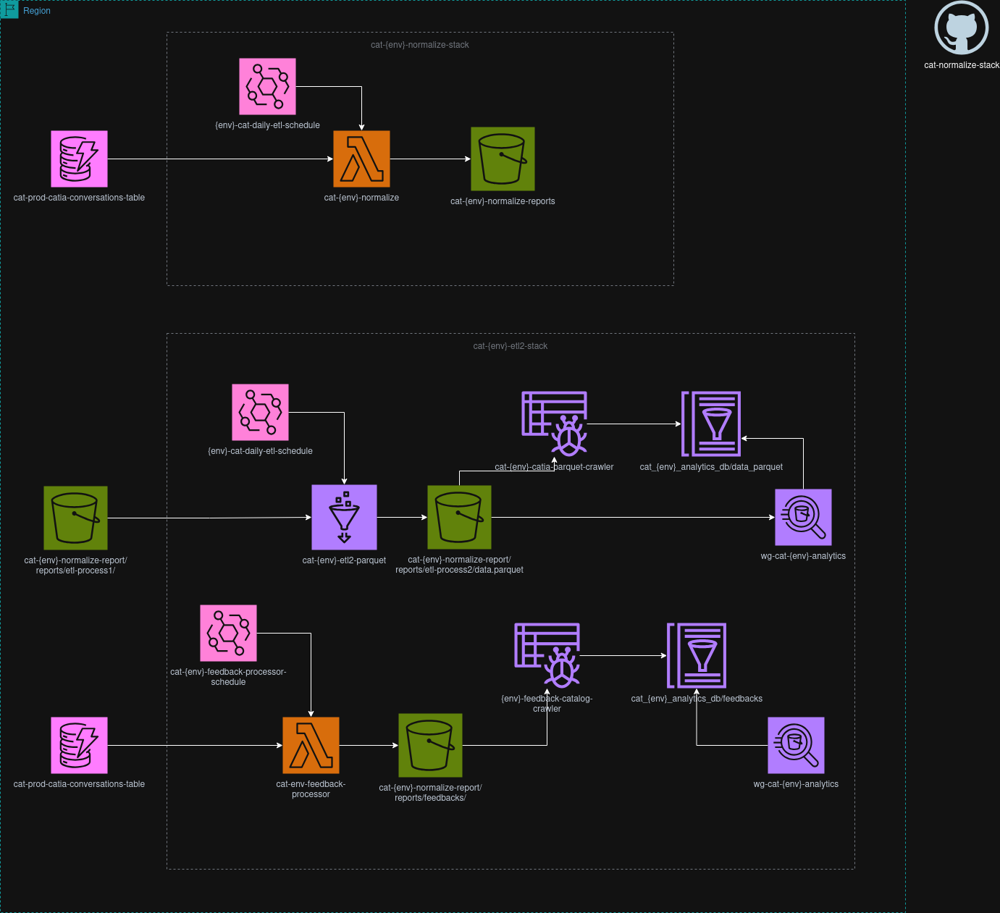

# CAT Data Platform - Multi-Stack Infrastructure

AWS CDK infrastructure for automated data processing and analytics pipeline with multi-environment support.

## Overview

This project provides a complete data platform that extracts conversation data from DynamoDB, transforms it through a two-stage ETL process, and makes it queryable via Amazon Athena.

### Architecture

The platform consists of two primary stacks:

1. **Normalize Stack (ETL-1)**: Extracts and normalizes data from DynamoDB to S3 CSV format
2. **ETL Stack (ETL-2)**: Transforms CSV data to Parquet format and manages the analytics catalog



**ETL-1 Process:**
- Scheduled Lambda function scans DynamoDB table
- Normalizes conversation data
- Writes CSV files to S3 with daily partitions

**ETL-2 Process:**
- EventBridge triggers Glue job when new CSV arrives
- Glue job transforms CSV to optimized Parquet format
- Glue Crawler automatically updates table schema
- Data becomes queryable in Athena

## Multi-Environment Support

The infrastructure supports independent test and production environments with separate configurations:

**Test Environment:**
- Manual execution (schedules disabled)
- Reduced resource allocation
- Isolated data storage
- Independent AWS resources

**Production Environment:**
- Automated daily execution
- Production-sized resources
- Optimized for performance
- Cost-optimized configurations

Configuration files are located in `lib/configs/`:
- `test-normalize.config.ts` / `prod-normalize.config.ts` - ETL-1 settings
- `test-etl.config.ts` / `prod-etl.config.ts` - ETL-2 settings

## Prerequisites

- Node.js 18.x or later
- AWS CDK CLI 2.x
- AWS credentials configured
- Python 3.9+ runtime available

## Stack Details

### Normalize Stack (ETL-1)

**Resources Created:**
- S3 bucket for data storage (Critical)
- Lambda function for data extraction and normalization
- EventBridge schedule for daily execution
- IAM roles with least-privilege permissions
- Lambda layer with Python dependencies (Pandas, AWS SDK)

**Key Features:**
- Scans DynamoDB table for conversation data
- Normalizes data structure
- Writes CSV files to S3 with timestamps
- Automatic error handling and logging
- Configurable execution schedule

### ETL Stack (ETL-2)

**Resources Created:**
- AWS Glue job for data transformation
- Glue Crawler for schema detection
- Glue Database and Table definitions
- Athena WorkGroup for queries
- EventBridge rules for orchestration

**Key Features:**
- Event-driven architecture (triggers on S3 upload)
- CSV to Parquet transformation
- Automatic schema evolution
- Optimized for analytical queries
- Athena integration for SQL access

## Configuration

### Normalize Stack Configuration

**Required Settings:**
- `s3BucketName`: S3 bucket for storing processed data
- `dynamoTableName`: Source DynamoDB table
- `lambda.name`: Lambda function name
- `lambda.timeout`: Execution timeout (seconds)
- `lambda.memorySize`: Memory allocation (MB)
- `schedule.enabled`: Enable/disable automatic execution
- `schedule.cronExpression`: Execution schedule (UTC)

**Environment Variables (Lambda):**
- `S3_BUCKET_NAME`: Target S3 bucket
- `DYNAMODB_TABLE_NAME`: Source table
- `PROJECT_ID`: Project identifier
- `ENVIRONMENT`: Deployment environment
- `CLIENT`: Client identifier

### ETL Stack Configuration

**Required Settings:**
- `dataBucketName`: S3 bucket name (from ETL-1)
- `cleanPrefix`: Input data prefix (CSV files)
- `curatedPrefix`: Output data prefix (Parquet files)
- `athenaResultsPrefix`: Athena query results location
- `catalog.databaseName`: Glue database name
- `athena.workGroupName`: Athena workgroup name

**Glue Job Settings:**
- `glue.version`: Glue version (default: "4.0")
- `glue.numberOfWorkers`: Worker count
- `glue.workerType`: Worker type (G.1X, G.2X, G.4X)

## Deployment

### Initial Setup

Clone the repository and install dependencies:

```bash
npm install
```

### Deploy to Test Environment

Deploy both stacks in order:

```bash
# 1. Deploy Normalize Stack (creates S3 bucket)
cdk deploy cat-test-normalize-stack -c environment=test

# 2. Deploy ETL Stack (uses existing bucket)
cdk deploy cat-test-etl2-stack -c environment=test
```

Or deploy all stacks together:

```bash
cdk deploy --all -c environment=test
```

### Deploy to Production Environment

```bash
# Deploy all stacks
cdk deploy --all -c environment=prod

# Or deploy individually
cdk deploy cat-prod-normalize-stack -c environment=prod
cdk deploy cat-prod-etl2-stack -c environment=prod
```

### Preview Changes

Before deploying, preview the changes:

```bash
# View changes for specific stack
cdk diff cat-test-normalize-stack -c environment=test

# View all changes
cdk diff --all -c environment=test
```

## Usage

### ETL-1: Normalize Stack

**Manual Execution (Test Environment):**

```bash
aws lambda invoke \
  --function-name cat-test-lambda-normalize \
  --payload '{}' \
  response.json
```

**Automatic Execution (Production):**
- Runs daily at configured schedule (default: 4:30 AM UTC / 11:30 PM Colombia)
- Check EventBridge console for execution history

**Monitor Execution:**

```bash
# View Lambda logs
aws logs tail /aws/lambda/cat-test-lambda-normalize --follow

# Check S3 for output
aws s3 ls s3://cat-test-normalize-reports/reports/etl-process1/
```

### ETL-2: Glue Job

**Automatic Execution:**
- Triggers automatically when new CSV files arrive in S3
- Glue Crawler runs after job completion to update schema

**Manual Execution:**

```bash
# Start Glue job
aws glue start-job-run --job-name cat-test-etl2-parquet

# Check job status
aws glue get-job-runs --job-name cat-test-etl2-parquet --max-results 5
```

**Start Crawler Manually:**

```bash
aws glue start-crawler --name cat-test-curated-crawler
```

## Resource Naming Convention

All resources follow environment-based naming:

**Test Environment:**
- Stacks: `cat-test-normalize-stack`, `cat-test-etl2-stack`
- Lambda: `cat-test-lambda-normalize`
- Glue Job: `cat-test-etl2-parquet`
- Glue Crawler: `cat-test-curated-crawler`
- Athena WorkGroup: `wg-cat-test-analytics`
- Glue Database: `cat_test_analytics_db`

**Production Environment:**
- Stacks: `cat-prod-normalize-stack`, `cat-prod-etl2-stack`
- Lambda: `cat-prod-lambda-normalize`
- Glue Job: `cat-prod-etl2-parquet`
- Glue Crawler: `cat-prod-curated-crawler`
- Athena WorkGroup: `wg-cat-prod-analytics`
- Glue Database: `cat_prod_analytics_db`

## Monitoring

### CloudWatch Logs

**Lambda Logs:**
```bash
aws logs tail /aws/lambda/cat-{env}-lambda-normalize --follow
```

**Glue Job Logs:**
- Available in CloudWatch under `/aws-glue/jobs/`
- View in Glue Console > Jobs > Run details

### CloudWatch Metrics

Monitor these key metrics:
- Lambda invocations, duration, errors, throttles
- Glue job run time, data processed, DPU usage
- S3 bucket size and request metrics
- EventBridge rule invocations

### Athena Query Performance

Monitor query performance in Athena console:
- Data scanned per query
- Query execution time
- Failed queries


## Maintenance

### Updating Configurations

1. Modify the appropriate config file
2. Review changes: `cdk diff cat-{env}-{stack}-stack -c environment={env}`
3. Deploy: `cdk deploy cat-{env}-{stack}-stack -c environment={env}`

### Updating Lambda Code

1. Modify code in `lambda/etl-process1/`
2. Deploy stack to update the function
3. Test in test environment before production

### Updating Glue Job Script

1. Modify code in `lambda/etl-process2/`
2. Deploy ETL stack to update the script
3. Verify job runs successfully

### Managing Data Retention

S3 lifecycle policies are configured in the Normalize Stack. To modify:

```typescript
lifecycle: {
  enabled: true,
  noncurrentVersionExpiration: 30  // Days
}
```

## Troubleshooting

### Lambda Timeout

If ETL-1 Lambda times out processing large datasets:

1. Increase timeout in configuration:
   ```typescript
   lambda: {
     timeout: 900,  // 15 minutes
   }
   ```
2. Consider increasing memory to improve performance
3. Implement pagination for large DynamoDB scans

### Glue Job Failures

Check Glue job logs in CloudWatch:
```bash
aws logs tail /aws-glue/jobs/error --follow
```

Common issues:
- Insufficient DPU allocation
- Schema evolution conflicts
- S3 permission errors

### Crawler Not Detecting Schema

Ensure:
- Glue job completed successfully
- Parquet files exist in curated prefix
- Crawler has S3 read permissions
- Crawler is targeting correct S3 path

### Athena Query Errors

Common fixes:
- Run Glue Crawler to update schema
- Check table location in Glue Console
- Verify S3 bucket permissions
- Ensure WorkGroup has correct output location

## Stack Dependencies

The ETL Stack depends on resources created by the Normalize Stack:

**Important:** Deploy Normalize Stack first on initial setup.

For subsequent updates, stacks can be deployed independently.

## Stack Outputs

After deployment, view stack outputs:

```bash
# Normalize Stack outputs
aws cloudformation describe-stacks \
  --stack-name cat-{env}-normalize-stack \
  --query 'Stacks[0].Outputs'

# ETL Stack outputs
aws cloudformation describe-stacks \
  --stack-name cat-{env}-etl2-stack \
  --query 'Stacks[0].Outputs'
```
## Tagging Strategy

Resources are tagged for cost allocation and management:

**Common Tags:**
- `Environment`: TEST or PROD
- `Project`: CAT-NORMALIZE
- `ProjectId`: P2124
- `ManagedBy`: CDK

**Component-Specific Tags:**
- `ETLComponent`: ETL-1 or ETL-2
- `ETLStage`: EXTRACT-TRANSFORM or TRANSFORM-LOAD
- `ResourceType`: COMPUTE, STORAGE, etc.

Filter costs in AWS Cost Explorer using these tags.

## Best Practices

1. **Always test in test environment first**
2. **Use `cdk diff` before deploying**
3. **Monitor CloudWatch logs after deployment**
4. **Validate data in Athena after ETL runs**
5. **Review costs regularly using tags**
6. **Keep configurations in version control**
7. **Document any custom changes**

## Contributing

When making changes:

1. Create feature branch from `main`
2. Update relevant configuration files
3. Test changes in test environment
4. Run `cdk diff` to review changes
5. Deploy to test and validate
6. Create pull request for review
7. Deploy to production after approval

## Support

For issues or questions:
- Check CloudWatch logs for error details
- Review troubleshooting section above
- Contact the data engineering team
- Refer to AWS CDK documentation

## License

Internal use only. Proprietary to the organization.